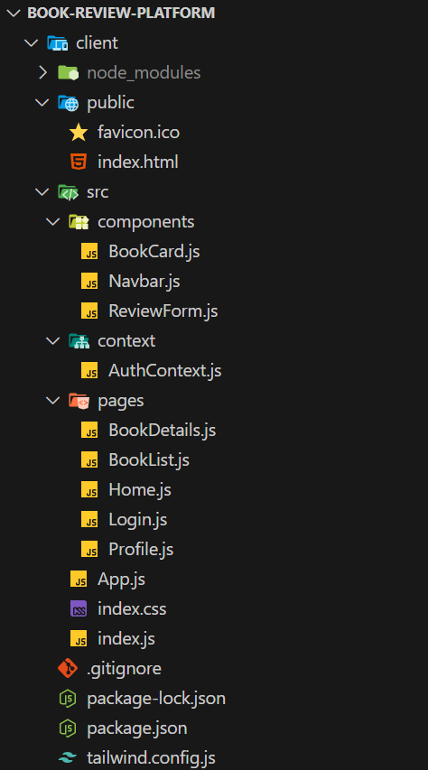
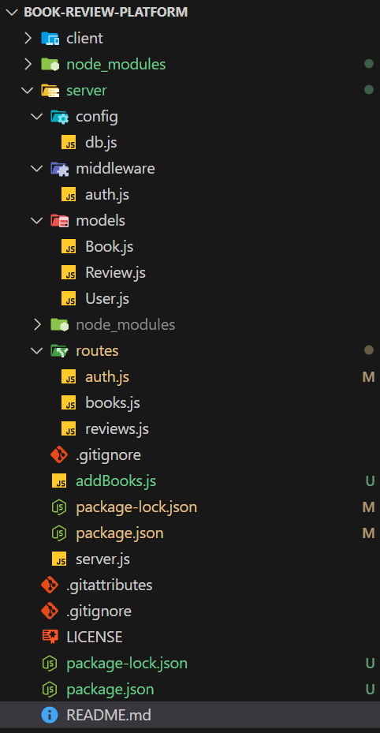

# Book Review Platform

## Project Overview

The Book Review Platform is a full-stack web application designed to allow users to browse books, read and write reviews, rate books, and manage their profiles. It features a React frontend for a dynamic user interface, a Node.js/Express backend for API functionality, and MongoDB as the database for storing users, books, and reviews. The platform includes admin functionality to add books, secured with JWT-based authentication. This project was developed as part of a Full Stack Developer assignment, completed on **May 23, 2025, at 10:59 PM IST**.

## What are the features?

* **Book Catalog**: Browse a list of books with details like title and author.
* **Reviews and Ratings**: Users can read, write, and rate reviews for books.
* **User Authentication**: Register and log in to access personalized features.
* **Admin Functionality**: Admins (e.g., users with emails containing "admin") can add books.
* **Preloaded Books**: Includes 12 classic books, such as "To Kill a Mockingbird" by Harper Lee.

## Preloaded Books

The following books are preloaded in the database:

* "To Kill a Mockingbird" by Harper Lee
* "1984" by George Orwell
* "Pride and Prejudice" by Jane Austen
* "The Great Gatsby" by F. Scott Fitzgerald
* "The Catcher in the Rye" by J.D. Salinger
* "Animal Farm" by George Orwell
* "Jane Eyre" by Charlotte Brontë
* "Wuthering Heights" by Emily Brontë
* "The Hobbit" by J.R.R. Tolkien
* "Brave New World" by Aldous Huxley
* "The Lord of the Rings" by J.R.R. Tolkien
* "Catch-22" by Joseph Heller

## Setup Requirements

To run the Book Review Platform, ensure you have the following tools installed:

* **Node.js**: Version 14.x or higher ([Download](https://nodejs.org/))
* **MongoDB**: Local MongoDB server ([Download](https://www.mongodb.com/try/download/community))
* **Git**: For cloning the repository ([Download](https://git-scm.com/))
* **Web Browser**: Chrome, Firefox, etc.
* **Postman (Optional)**: For testing API endpoints
* **Operating System**: Windows, macOS, or Linux

### Additional Setup for Windows

* Add MongoDB to the system PATH (e.g., `C:\Program Files\MongoDB\Server\7.0\bin`)
* Verify: `mongod --version`
* Create a data directory: `mkdir C:\data\db`

## Project Structure

```
book-review-platform/
├── client/                     # React frontend
│   ├── public/                # Static assets
│   ├── src/                   # React source code
│   │   ├── components/        # Reusable components
│   │   ├── pages/             # Page components
│   │   ├── context/           # State management
│   │   ├── App.js             # Main app component
│   │   └── index.js           # React entry point
│   ├── package.json           # Frontend dependencies
├── server/                     # Node.js/Express backend
│   ├── models/                # Mongoose models
│   ├── routes/                # API routes
│   ├── middleware/            # Custom middleware
│   ├── config/                # Configuration
│   ├── server.js              # Main server file
│   ├── addBooks.js            # Script to add books
│   ├── package.json           # Backend dependencies
├── README.md                  # Project documentation
└── .gitignore                 # Git ignore file
```

## How to Run the Project

### 1. Clone the Repository

```bash
git clone https://github.com/yourusername/book-review-platform.git
cd book-review-platform
```

Replace `yourusername` with your actual GitHub username.

### 2. Set Up MongoDB

**Windows:**

```bash
mongod --dbpath C:\data\db
```

Or ensure the MongoDB service is running.

**macOS/Linux:**

```bash
sudo systemctl start mongod
```

Or:

```bash
mongod
```

Verify MongoDB:

```bash
mongosh
show dbs
```

### 3. Set Up the Backend

```bash
cd server
npm install
npm start
```

Look for: `Server running on port 5000` and `MongoDB connected`.

**Test API with Postman (Optional):**

* Register:

  * `POST http://localhost:5000/api/auth/register`
  * Body:

    ```json
    {
      "email": "admin@example.com",
      "password": "admin123"
    }
    ```
* Login:

  * `POST http://localhost:5000/api/auth/login`
  * Body:

    ```json
    {
      "email": "admin@example.com",
      "password": "admin123"
    }
    ```

### 4. Set Up the Frontend

```bash
cd ../client
npm install
npm start
```

Open: `http://localhost:3000`

### 5. Access the Application

* Register/login at `http://localhost:3000`
* Browse books: `http://localhost:3000/books`
* Admin add books: `http://localhost:3000/add-book`

### 6. Add Preloaded Books (Optional)

```bash
cd server
node addBooks.js
```

Update `addBooks.js` with your admin credentials.

## Troubleshooting

**Registration Failed**:

* Use a new email or delete an existing one:

```bash
mongosh
use book_reviews
db.users.deleteOne({ email: "admin@example.com" })
```

**MongoDB Not Running**:

* Run `mongod` or check MongoDB service.

**Connection Issues**:

* Verify connection string in `server/config/db.js`
* Check port:

```bash
netstat -aon | findstr :27017
```

**Frontend Not Loading**:

* Ensure backend is running on `http://localhost:5000`
* Check browser console for errors.

**CORS Errors**:

* Restart backend server.

## Contributing

1. Fork the repository.
2. Create a branch:

```bash
git checkout -b feature/new-feature
```

3. Make changes and commit:

```bash
git add .
git commit -m "Add new feature - May 23, 2025, 10:59 PM IST"
```

4. Push and create a pull request:

```bash
git push origin feature/new-feature
```

## 📸 Application Snapshots

### 1. 🗃️ BRP Database Overview
  
*Structure of the MongoDB database showing collections for users, books, and reviews.*

---

### 2. 🔐 Bearer Token Generation
  
*Successful login response showing the generated JWT token for user authentication.*

---

### 3. 🔑 Bearer Token in Authorization Header
  
*Token inserted into the Authorization header for secure API requests.*

---

### 4. 📊 Book Review Dashboard
  
*Main dashboard showcasing books, ratings, and user interactions.*

---

### 5. 📚 Books in Database
  
*Snapshot of books collection in MongoDB, displaying preloaded classic titles.*

---

### 6. 💻 React Client Structure
  
*Project structure of the React frontend application inside the client folder.*

---

### 7. ✍️ Giving a Book Review
  
*User interface for submitting a book review and rating.*

---

### 8. 🗒️ Reviews in Database
  
*MongoDB document showing how submitted reviews are stored.*

---

### 9. 🌐 Node.js Server Setup
  
*Project structure of the Node.js backend, showing routes, models, and config files.*

---

### 10. 📬 View Books via Postman API
  
*Postman request displaying all books retrieved from the backend API.*

---

### 11. ➕ Add New Book via Postman
  
*Admin API call in Postman for adding a new book to the database.*

---

### 12. ✅ Review Submission Success
  
*Book detail page updated with the newly submitted review and rating.*

---

---


## License

This project is licensed under the MIT License. See the LICENSE file for details.
